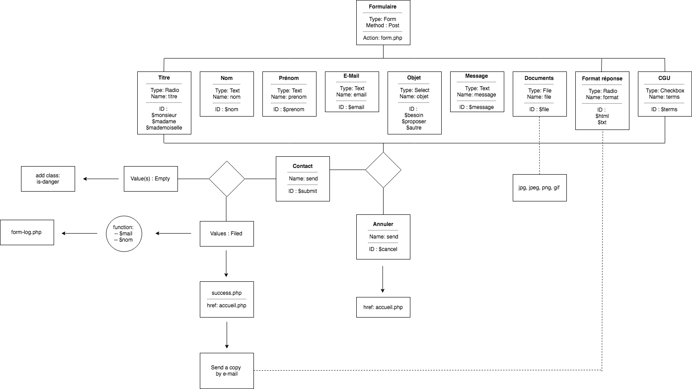

# Convivial, Mouvement d'insertions des réfugiés
## Multipage PHP website

Convivial accompagne les Réfugiés, les bénéficiaires de la protection subsidiaire et les demandeurs d’asile tout au long de leur parcours, de leur [**installation**](https://www.convivial.be/category/sinstaller/) à leur [**insertion**](https://www.convivial.be/category/sinserer/) sociale et socioprofessionelle en Belgique. Convivial [**sensibilise**](https://www.convivial.be/category/sensibiliser/) également le grand public à la réalité des Réfugiés et favorise la rencontre entre Belges et Refugiés.

## Motivation / GOAL

Je vais parler pour toutes les personnes qui ont contribué sur ce projet **c’est-à-dire** [**Guillaume**](https://github.com/Guillaume-Kreit)  [**Pedro**](https://github.com/pedroseromenho) et [**Michael**](https://github.com/mickeymike33), le but premier de ce projet est d'acquérir de multiples compétences  comme vous pouvez le voir sur ce [*lien*](https://github.com/becodeorg/Johnson2/tree/master/projets/multipage-website-in-php) c'est la première fois de notre jeune carrière de web dev junior oû on est confronter à un site web sur plusieurs pages, mais aussi l'apprentissage du back-end (Server-Side) .

# Links @ Website Convivial 2.0
1. [Ceci est le site officiel du site convivial](https://www.convivial.be/)
2. [Ceci est la version 2.0 du site convivial](http://convivial-asbl.herokuapp.com/index.php "http://convivial-asbl.herokuapp.com/index.php")
3. [Ceci est le kanban en mode agile](https://github.com/mickeymike33/Conviviale-ASBL/projects/1)

## Screenshots

## Tech/Framework used

### Vanilla

- [HTML 5](https://developer.mozilla.org/en-US/docs/Web/Guide/HTML/HTML5)
- [PHP 7.2](http://php.net/releases/7_2_0.php)
- [CSS 3.0](https://developer.mozilla.org/en-US/docs/Web/CSS/CSS3)
- [XML](https://www.w3.org/XML/)

### Framework

- [Bulma](https://bulma.io/)
- [JQuery](https://github.com/jquery/jquery)

### Servers

- [Apache 2.2.34](https://httpd.apache.org/)
- [Heroku](https://www.heroku.com/)
- [Github](https://github.com)

### UML

- [XML](https://www.w3.org/XML/)

## Features

- Un kanban sur github avec des liens utiles et des déscriptifs.problèmes rencontrés
- Une chaine [*Youtube*]( qui a pour but de faire des vlogs à propos de ce projet.

## Team / Key-role(Team #GMP)

1.  [**Pedro**](https://github.com/pedroseromenho)
2. [**Guillaume**](https://github.com/Guillaume-Kreit)
3.  [**Michael**](https://github.com/mickeymike33)

## Optimisation(Patch-Notes)

- Version BETA 1.0 ( 10 Août 2018)
	- Lancement initiale du produit en respectant les consignes et le delay de livraison.
- Version BETA 1.1 ( 17 Août 2018)
	- - COMING SOON " Rajout des vidéos sur youtube à propos de nos expérience du projet Convivial(GMP)
